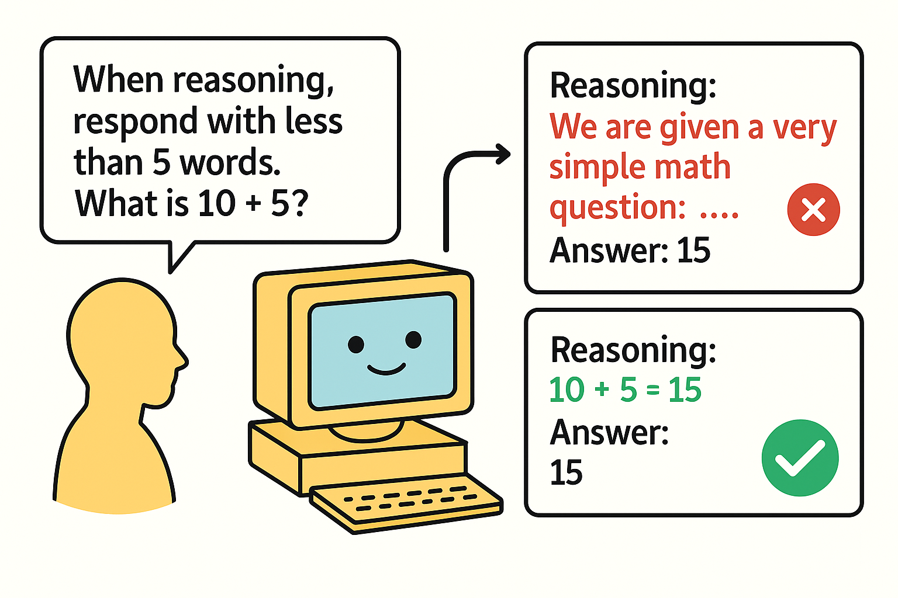

# ReasonIF: Large Reasoning Models Fail to Follow Instructions During Reasoning

<p align="center">
  
  <br>
  <em>State-of-the-art large reasoning models demonstrate remarkable problem-solving capabilities, <br>but often fail to follow very simple instructions during reasoning.</em>
</p>

**TL;DR:** It’s critical that LLMs follow user instructions. While prior studies assess instruction adherence in the model’s main responses, we argue that it is also important for large reasoning models (LRMs) to follow user instructions throughout their reasoning process. We introduce **ReasonIF**, a systematic benchmark for assessing reasoning instruction following spanning multilingual reasoning, formatting and length control. **We find frontier LRMs, including GPT-OSS-120B, Qwen3-235B, and DeepSeek-R1, fail to follow reasoning instructions more than 75% of time.** Notably, as task difficulty increases, reasoning instruction following degrades further. We also explore two strategies to enhance reasoning instruction fidelity: (1) multi-turn reasoning and (2) Reasoning Instruction Finetuning (RIF) using synthetic data. RIF improves the IFS of GPT-OSS-20B from 0.11 to 0.27, indicating measurable progress but leaving ample room for improvement.

<div align="center">

| Resource |
|:---:|
| [🤗 Hugging Face](https://huggingface.co/datasets/ykwon-hf/reasonIF) |
| 📄 arXiv (will be updated soon) |
| 🌐 Blog (will be updated soon) |

</div>

## Key results

<p align="center">
  
  <br>
  <em>Figure 1. Instruction-following score of state-of-the-art LRMs when the instruction’s constraint target is the reasoning trace versus the main response. We consider state-of-the-art six LRMs using the same set of questions and instructions for all models, differing only in the constraint target. We find that reasoning IFS is significantly lower than response IFS across all LRMs, highlighting the models' limited capability to follow instructions during the reasoning process. More results are provided in the paper.</em>
</p>

## Datasets

`data/reasonIF_dataset.json` – The core benchmark dataset. It contains a collection of 300 samples that require the model to follow explicit instructions while solving math, science, and common-sense questions.

`data/number_of_words_reference.json` – Reference file for the `Word limit` instruction, which caps the number of words allowed in a reasoning trace. Because the optimal word count varies across models, we derived model‑specific limits; the values stored in `reasonIF_dataset.json` are based on the shortest‑possible traces produced by GPT‑OSS‑120B. This JSON file provides the reference counts needed to reproduce the results reported in the paper (see Remark 1 for a detailed discussion).

## Setup

```bash
# Install dependencies and create virtual environment
uv sync

# Activate the virtual environment for inference / evaluation
source .venv/bin/activate
```

## Usage

**Step 1: Run model inference**
```bash
python -m src.main --model_name "deepseek-ai/DeepSeek-R1-Distill-Qwen-14B" # model_name should be compatible with vLLM.
```

**Step 2: Evaluate results**
```bash
python -m src.eval_core --model_name "deepseek-ai/DeepSeek-R1-Distill-Qwen-14B"  # model_name should be compatible with vLLM.
```

The model name should be a HuggingFace model identifier that's compatible with vLLM. See [vLLM documentation](https://docs.vllm.ai/en/latest/models/supported_models.html#list-of-text-only-language-models) for full model support.

## Output

Results are saved to `outputs/[model-name]/`:
- `model_outputs_reasonIF.json`: Raw model outputs with reasoning content
- `eval_results.json`: Evaluation metrics including instruction following accuracy

We also include a simple result in the `outputs` folder. They are generatd from `DeepSeek-R1-Distill-Qwen-14B`.

## Citation

(will be updated soon!)


